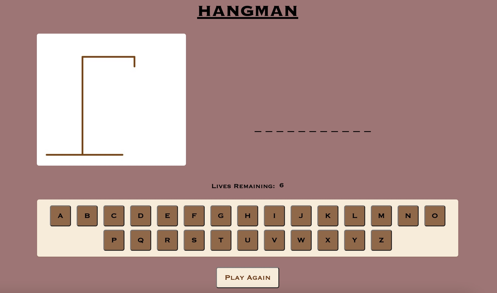
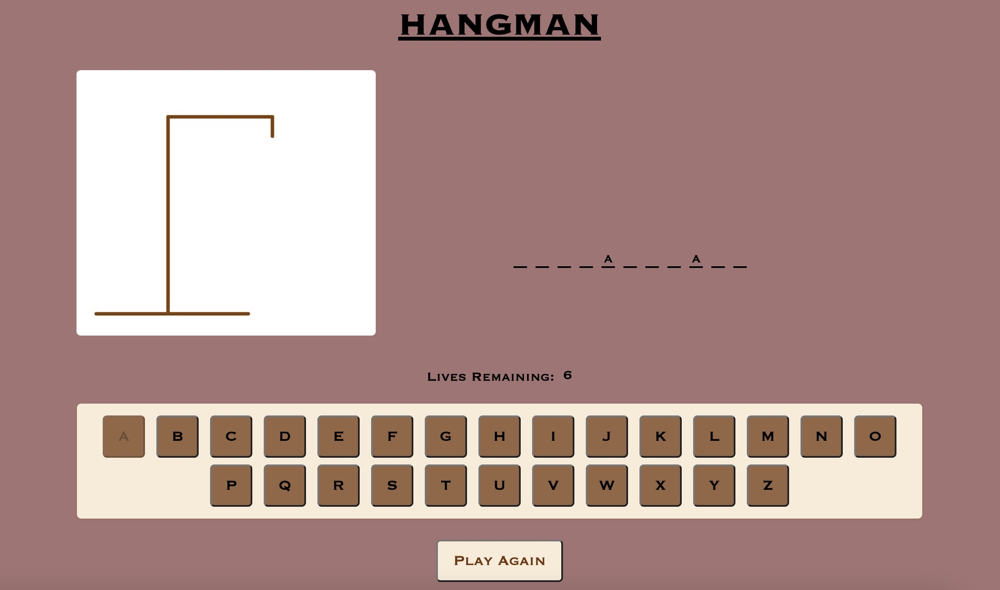
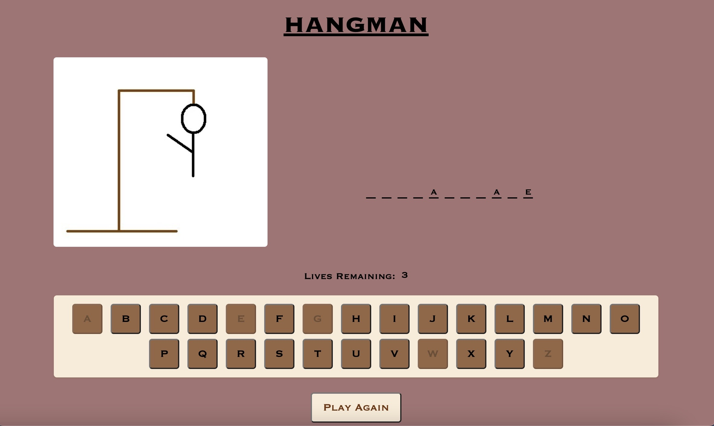
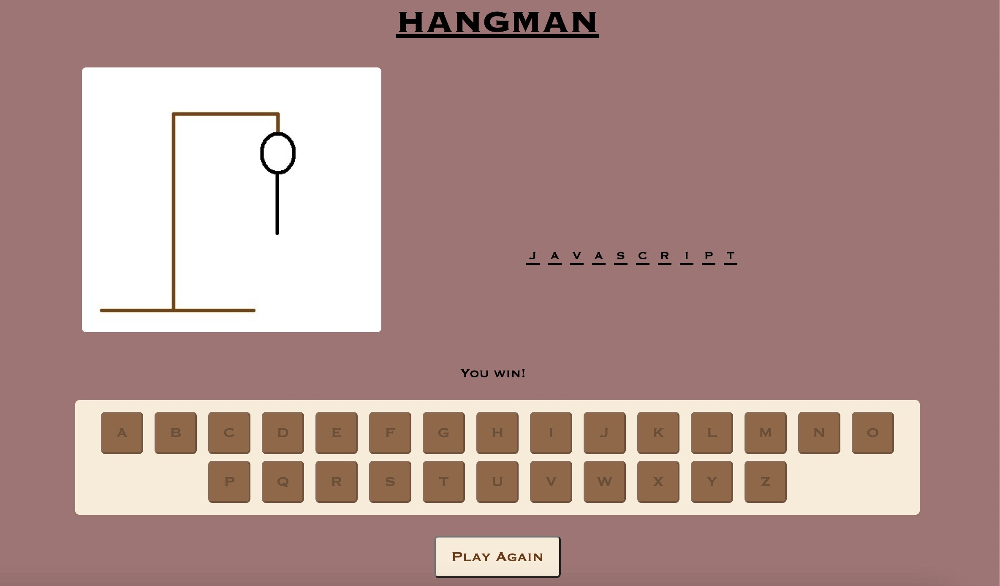

# Raegan's Hangman Browser Game - Project 1

### How to Play

Welcome to my Hangman browser game (figure 1)! 

Try and guess the secret "SEI" word by selecting letters on the keyboard.  If you guess a letter correctly, it will appear in the appropriate blank (figure 2).  If you guess a letter incorrectly, you will lose a life (figure 3).  Try and guess all of the correct letters in the word before your man is hung (figure 4)!

### Sreenshots

Figure 1

Figure 2

Figure 3 

Figure 4

### Technologies Used

This game was built in VSCode using HTML, CSS, JavaScript, and an assets folder containing images.

### Launch the Game!

[Click here](https://raeganmb.github.io/project-1) to play!
